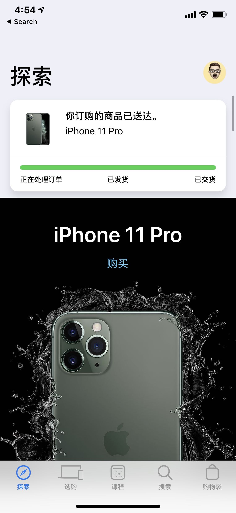

**NOTE： 手机到了，更新一波小发现。**

虽然 iPhone 在每次发布会前都会被大大小小的曝光：**外观，三摄，Logo 居中**等等看上去让人很失望的改变，而在看了直播发布会后也真的同样，很失望😣。但主要原因还是我的听力不太行，所以发布会的时候会忽略很多细节。真的认为这次单单就是加了个颜色，屏幕稍稍好了点点，以及摄像头翻新。抱着发布会看都看了，总要买点啥（体验下最先进的技术）的心态，所以我最初是想买一个 Apple Watch series 5，毕竟 *Always on* 看上去还是很黑科技的。

可是等发布会过了几天，自己再到官网好好审视这次 iPhone 11 Pro 的文案，以及相比 iPhone XS 的对比，发现了很多我发布会上没注意到的东西。

1. 工艺升级。双离子交换工艺成就的亚光质感并且更耐操的玻璃后盖
2. Logo 居中，但是并不知道是因为美观问题还是支持了无线充电，这个没有提到
3. 升级的前置摄像头，更快的神经网络架构意味着更快的 Face ID 解锁
4. 防水能力提升
5. 屏幕对比度提升一倍，黑得更黑，亮得更亮。支持 HDR 的视频效果贼棒。而关于杜比音效和 HDR 10 的效果，在国内的视频网站是很难感受到，Apple TV 不知道怎么播放视频，只能靠开几个月贵的要死的 Netflix 来试试
6. 3D Touch 没了，换来了更厚更重，更强的续航🌞
7. Space Audio 和杜比全景声。我原以为 XS 支持了，结果官网说的只是**更宽广的立体声**
8. 双卡✨
9. U1 芯片，目前只是提升 Airdrop 的能力

这其中最让我把持不住的，有三点。亚光质感带来的手感提升，屏幕的提升和外放能力的增强。
关于 OLED 和 LCD 屏幕效果的差别，在平时可能不那么容易体现，但是如果在一个关上灯的房间里，你打开微信读书，调到夜间模式。再注意到 iPad 和 iPhone 的区别，就能体会到 OLED 的黑色有多么的深邃🌚 （有可能微信没有给 LCD 屏幕黑色）。这种感觉在我第一次察觉到后，就再也不想回到 LCD 了。
所以即使这次 iPhone 11 也很良心，包括摄像头，屏幕，质感外也都得到了提升，但就因为这个屏幕我还是放弃了。

另外，苹果还将为 Pro（还是 A13 都行？） 带来了一个被称为 Deep Fusion 的拍照技术，大概就是通过机器学习让算出图片放大后的样子。这个似乎华为和谷歌都做过了，而且在官网也没看到相关预告，仅仅只是在发布会中提到了一下。

我相信这一代的升级，相比去年对比 iPhone X 的升级，肯定还是有一大波消费者「真香」的，毕竟新配色，新外观。而且我在对比了 iPhone XS 和 iPhone X 的区别后发现，XS 的改动更加不值得一提( ･᷄ὢ･᷅ )

而关于是否支持 5G，这就是个伪命题。本来技术就没准备好，5G 的标准也在今年 7 月份才最终制定完毕，而且没有 IOT 的 5G 除了网速看上去稍微快点，也不会一下子就有太大的改进。再加上基站的数量并没有提升，导致最初天线去获取 5G 所需要的功率可能要更高，也就意味着更加耗电。这就让价格敏感用户们，抓着这个他也不知道到底是啥东西的 5G 不放，因为他们希望这部手机至少能用到三年吧～

所以最后掂量了一下手中的 XS，越看后背的双摄越觉得丑。然后又想到这次升级 iOS 13 搞得我的电池消耗非常大，一天一天都顶不住了。看了下 Trade-in，可以卖个 3300 🌞

[iPhone 对比](https://www.apple.com/cn/iphone/compare/ "iPhone 对比")

## 补充

最近看了些评测，发现相机的提升实在太强了。首先是夜间模式的能力大幅提升，这个相信大家都已经看过样图和赞美的文章了。

另外还有几个被广为称赞的细节：
首先苹果是把三个相机同时打开并实时取景的，在你拍一张照片的时候其实是拍了至少三张不同焦距的照片，并保存下来，你在编辑相片的时候可以随意决定是否切换成其他的焦距。这个可以在相机设置中决定是否关闭

第二，前置摄像头变成了广角。这意味着和 XS 的相比，脸看上去不会那么大了，Face ID 的能力也肯定会更强。只不过默认情况下，苹果通过照片的裁切让一开始的脸不会那么小。一旦你在使用前置摄像头的时候，如果将手机横屏，就能明显地看到整个视角的调整。不过目前看来，这个视角调整的动画还比较生硬

## 真机体验

真机在下单了 20 天之后总算到了😣，在我写的时候还没怎么玩，天气不是太好，并没有怎么拍照。
几个很明显的区别先说一说：

1. 虽然 3D Touch 没了，但是它的长按时间是可以控制的。所以最后的效果是**比重按慢了一点，但是比 XS 上的长按相应要快。** 所以并不会出现那么严重的的不适用问题。反而是国内基本上所有 app 都没适配 iOS 13 的 `Context Menu API`，导致之前习惯的 `Peek and Pop` 交互用不了了。这就是大公司产的 app 和小团队做的 app 的明显区别
2. 后背的手感相比 XS，爽多了。XS 在吸了很多指纹或者使用过多但是没有清洗的话，就会感觉有点粘粘的（嗯，我是个邋遢的人🌚）
3. 其实三摄比 XS 的双摄好看，特别是这次选了个绿色的～
4. 虽然 11 Pro 是 188g，XS 是 177g，对我个人来说，抓在手上感觉差不多

### 相机 📷 App 的体验

不过说到底，如果之前没用过 X 系列的产品的话，iPhone 11 显然是十分值得去升级的。但是如果是从 XS 升级过来的，能够直观感受到的变化真的也就**一个相机了。**

下面直接直接总结：

1. 新的 UI 和交互，这个要用了真机才知道，或者看一下我[分享的视频](https://share.icloud.com/photos/0o4g_GYxnKlPleNHr5i3-mY1Q)。如果语言设置为英文的话，可以看到发布会上提到的 *SF Camera*
2. 拍照模式切换焦距的动画挺自然，但是摄影模式完全崩了。我开始以为是没有动画，后来用延迟摄影试了下后，可能是给的动画时间太短了，导致整个过程很生硬
3. 两部手机都在主摄像头下，同一个位置拍同一个物体，焦距似乎有点不太一样，11 看到的画面更靠近物体
4. 自拍的时候，可以模拟一个简单的广角效果，让头偏离镜头
5. 人像模式支持切换焦距

拍照效果呢，我还没仔细测试，就上传随手拍的照片的 [iCloud 链接](https://share.icloud.com/photos/0Ne6a8QG8sGlDD3lyPD09Wn6Q#Wuhua_Xiaokang_Residential_District)吧。
音效，屏幕的提升我还没测出来，偷偷安利下 HomePod，配合 Netflix 爽爆，而且基本上感觉不到延迟！！目前国内支持 HomePod 的就是腾讯视频了，其他的 app 在 AirPlay 投过去后，都有非常明显的延迟。

> iCloud 分享的视频会在 11 月 4 号过期
