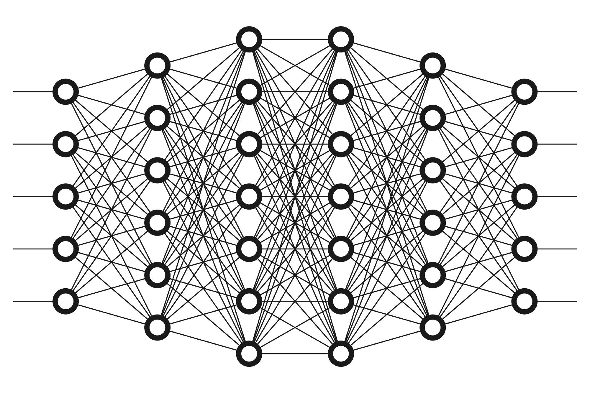
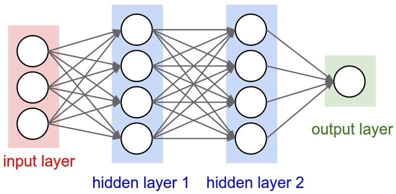
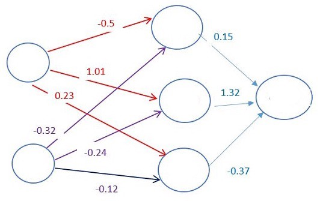
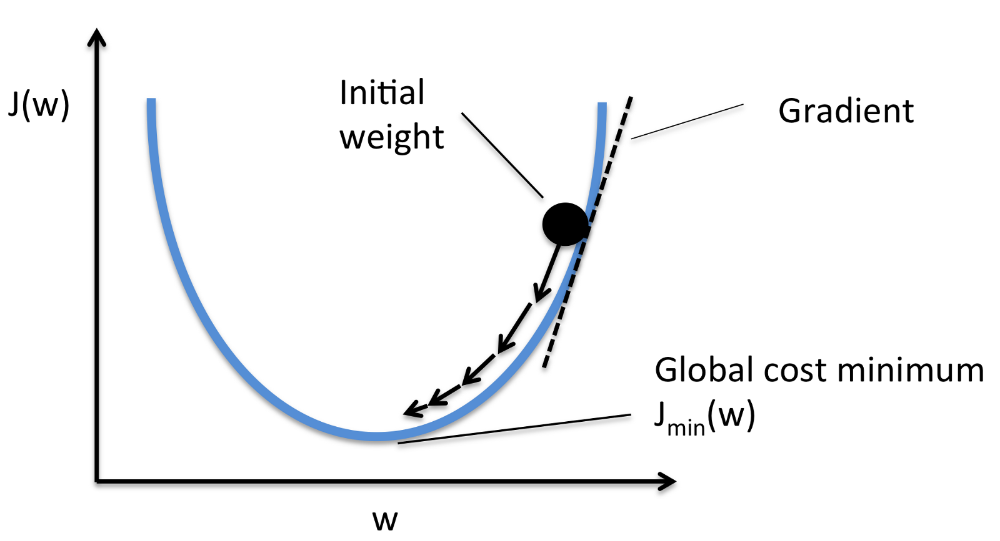

**AI(Artificial Intelligence)** 和 ML(Machine Learning) 是当下最热的话题.

我们每天都能看到 AI 的字眼, 那些有抱负的程序员都说自己想学点 AI. 你也听到高层说他们想在服务中集成 AI. 但是, 大多数人其实不理解什么是 AI.

一旦你读过了这篇文章, 你就会理解基础的 AI 和 ML 知识. 最重要的是, 你将会理解什么是 *[深度学习](https://en.wikipedia.org/wiki/Deep_learning)*—最流行的 ML 方法, 是怎么工作的.

这篇介绍面向所有人, 所以不需要任何数学基础.

## 背景
理解深度学习的第一步是分清两个重要术语的区别.

### 人工智能 VS 机器学习
> **人工智能** 是人类智能在计算机中的模拟

当 AI 研究首次开始的时候, 研究者会尝试去复制人类在特定行为下的思考方式—比如玩游戏

他们会描述出计算机需要遵守的大量规则. 计算机有一个特定的动作集, 并且根据这些动作集作出决策.

> 机器学习指的是机器具有一种在大规模数据集下学习的能力, 而不再需要提前规定各种规则

 ML 允许计算机自主学习. 这种学习方式充分利用了现代计算机的处理力, 能够轻松的处理**大规模**数据集.

### 监督性学习 VS 非监督性学习
> 监督性学习需要使用标记过的数据

当你使用监督性学习训练 AI 的时候, 你需要给它一个输入和希望得到的结果(输出)

如果 AI 得到的结果是错的.它会自动调整它的计算方式. 这个过程通过不断地遍历数据集, 指导 AI 得到的结果和期望输出值没有任何出入后, 才停止.

一个监督性学习的例子是天气预测 AI. 它会使用历史数据来学习预测. 训练数据包括了输入(气压, 潮湿度, 风速)和输出(气温)

> 非监督性学习是使用没有特定结构的数据的一种训练方式

当你打算使用非监督性学习来训练 AI 的时候, 你需要让 AI 自己决定如何对数据分类.

一个监督性学习的例子是电商网站的行为预测 AI. 它不能用标记过的数据来训练.

取而代之的是, 它会对输入数据创建自己的分类, 它会告诉你哪种用于最可能买的东西.

## 那么, 深度数学呢
你要开始准备理解深度学习, 和它工作的方式咯.

深度学习是一种**机器学习的方法**, 它让你训练 AI 来针对输入给出对应的输出. 无论监督性学习还是非监督性学习都可以用来训练.

我们通过假象一个**飞机票预测服务**来学习深度学习的公粥方式. 我们使用监督性学习来训练它.

我们希望我们的机票预测器能够使用下面的输入(去掉了剩余票来保证简单)来预测价格:
* 出发地
* 目的地
* 出发时间
* 航空公司

### 神经网络
让我们来深入我们 AI 的大脑.

就像动物一样,我们的预测 AI 的大脑拥有神经元. 用圆来表示它们. 这些神经元是互相连接的.

这些神经元被分成三种不同的层:
1. 输入层
2. 隐藏层
3. 输出层

> 译者注: 就是因为隐藏层的行为是黑盒的, 连创造这个 AI 的人都不知道为什么会这样. 这也就是为什么有些大佬针对 AI 会有一些担心. 虽然目前的 AI 还处于比较弱智的阶段, 但是就像互联网的发展一样, 没人能预测到 20 年后的 AI 会到怎样的程度.

**输入层**接受输入数据. 在我们的场景下, 我们的输入层有四个神经元: 出发地, 目的地, 出发时间, 航空公司. 输入层将这些输入传给第一个隐藏层.

**隐藏层**会对输入的数据执行数学运算. 一大挑战是: 决定使用多少层隐藏层以及每一层有多少个神经元(越多越慢, 但是效果也越好)

深度学习中的 **Deep** 指的就是多于一层的隐藏层.

输出层就会返回输出的数据. 在我们的案例下, 它会告诉我们价格预测.

所以, 这个价格预测是怎么算出来的呢?
这就是深度学习的**黑魔法**

每一个神经元都是以**权重**来连接的. 权重指的就是某一个输入值的重要性. 初始权重是随机的.

当我们预测飞机票的价格的时候, 出发时间是一个重要的影响因素, 所以和出发时间相连接的神经元, 都会获得一个很高的权重.

每一个神经元都有一个[激励函数](https://en.wikipedia.org/wiki/Activation_function), 这些函数没有数学基础的话很难解释.
简单地说, 它的一个用处就是标准化这些神经元的输出值.

一旦这些输入数据通过了所有的神经网络后, 它们就会通过输出层被返回出来.
一点都不难, 对吧?

### 训练神经网络
训练 AI 是深度学习最难的部分. 为什么?
1. 你需要有大量的数据
2. 你需要有庞大的算力

对于我们的机票价格预测系统, 我们需要寻找历史机票价格的数据. 因为机场和出发时间又有大量的组合, 我们就需要非常庞大的数据集.

为了训练 AI, 我们需要给他输入值, 然后将它的输出值和数据集中的输出值进行比较. 因为 AI 还没有训练完成, 这个输出肯定是错的.

一旦我们遍历过一次所有的数据集后, 我们创造一个用来暂时 AI 的输出和预期输出之间的差别. 这个函数被称为**开销函数**.

理想情况下, 我希望我们的开销函数是 0. 也就是 AI 的输出和数据集的输出完全一致.

### 怎么降低开销
我们需要修改神经元之间的权重. 我们可以随机的改变他们直到开销很低. 但是这个方法显然不怎么高效.
相反, 我们会使用一个叫做 [梯度下降](https://en.wikipedia.org/wiki/Gradient_descent) 的方法.

深度下降是一种让我们能找到函数最小值的方法. 在我们的场景下, 我们需要寻找开销函数的最小值.

它的工作方式是**在每次遍历数据后**, 一点一点的**修改权重**. 通过计算在某一特定数据集下, 开销和对应权重的函数的斜率, 我们可以知道哪个方向可以得到最小值.

为了最小我们的开销, 需要遍历数据集很多次. 这也是为什么你需要非常庞大的计算力.
使用梯度下降的方法来更新权重是**全自动**的, 这也是深度学习的黑魔法.

一旦我们训练好我们的 AI, 就能用来预测未来的机票价格了.

## 在哪可以学到更多
还有很多其他类型的神经网络: 计算机视觉使用[卷积神经网络](https://en.wikipedia.org/wiki/Convolutional_neural_network), 自然语言处理使用[递归神经网络](https://en.wikipedia.org/wiki/Recurrent_neural_network).

如果你想学习深度学习, 我建议还是去找在线课程.
当前最好的课程之一就是吴恩达的[深度学习标准](https://www.coursera.org/specializations/deep-learning). 如果你对证书没兴趣的话, 可以不需要为这门课程付费. 你可以免费旁听.

## 总结
* 深度学习使用神经网络来模仿动物的智能
* 神经网络有三种层: 输入层(Input Layer), 隐藏层(Hidden Layer) 和 输出层(Output Layer)
* 神经元之间通过权重连接, 展现了输入数据的重要程度.
* 神经元使用对数据使用激励函数来标准化输出
* 为了训练神经网络, 你需要大量的数据
* 遍历数据并且比较, 会有一个开销函数. 它表明了当前 AI 离可以用还差多远
* 每次遍历数据后, 通过梯度下降来降低开销, 以调整神经元之间的权重
